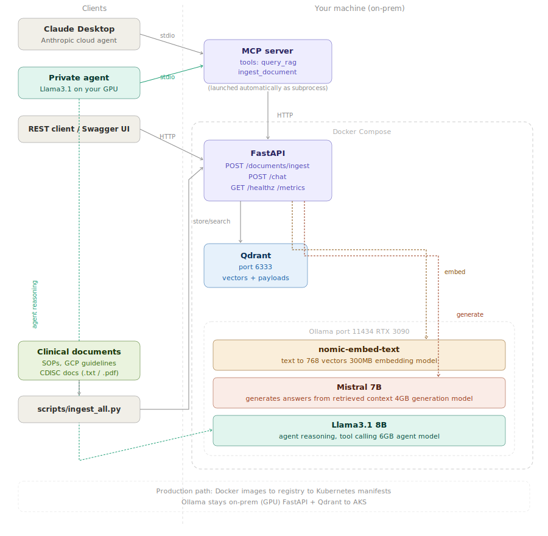
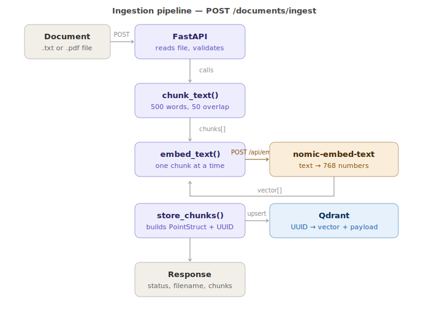
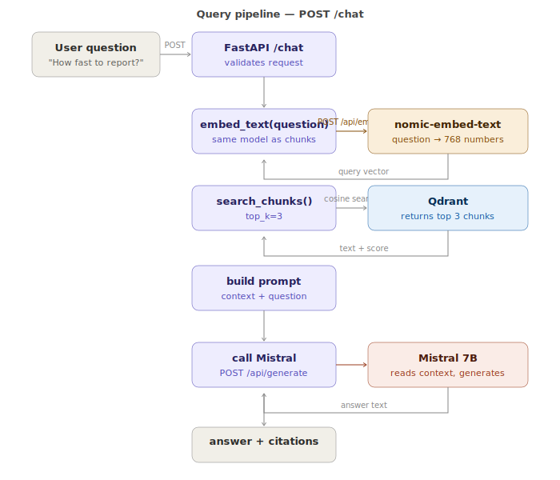
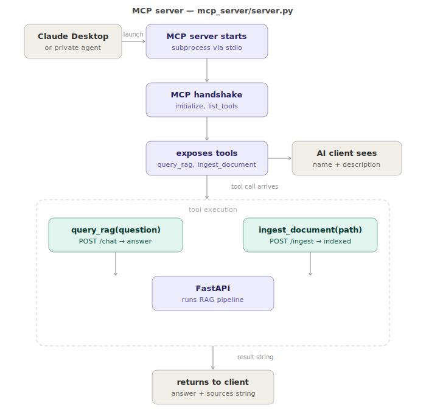
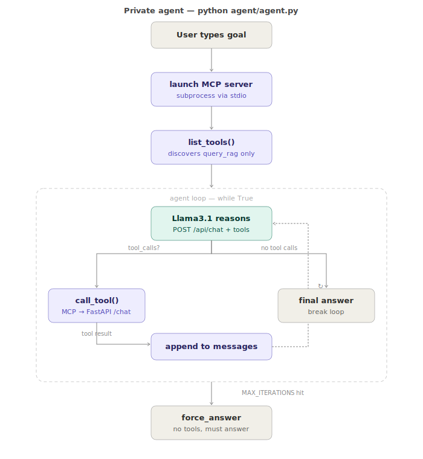

# ClinicalRAG — Architecture Deep Dive

This document explains how ClinicalRAG works internally — every component, every design decision, and why things are built the way they are. It is written to be useful both as a study guide and as a reference for anyone who wants to understand or extend the system.

---



## Part 1 — Foundations

### The problem this solves

Clinical research organizations deal with large volumes of documents — trial protocols, SOPs, GCP guidelines, regulatory submissions. Staff need to find specific information quickly: "what does our SOP say about adverse event timelines?" or "what are the GCP requirements for informed consent?"

The traditional approach is keyword search or manual reading. Both are slow and error-prone.

The modern approach is to use an LLM — but sending sensitive clinical documents to OpenAI or Anthropic violates data governance requirements. Under GDPR and ICH E6 GCP, patient data and proprietary trial information cannot be sent to external services.

ClinicalRAG solves this by running everything locally: the LLM, the embeddings, the vector database. Nothing leaves the network.

---

### What RAG is

RAG stands for Retrieval-Augmented Generation. It is a pattern for making an LLM answer questions about documents it was not trained on.

The core insight is simple: instead of asking the LLM to remember everything, you retrieve the relevant parts of your documents at query time and give them to the LLM as context.

Without RAG:
```
User: "What does our SOP say about adverse event timelines?"
LLM: makes something up or says it doesn't know
```

With RAG:
```
User: "What does our SOP say about adverse event timelines?"
System: searches documents → finds relevant paragraph → gives it to LLM
LLM: "According to your SOP, serious adverse events must be reported within 24 hours."
```

The LLM is not searching the documents — it is reading the paragraph you retrieved and summarizing it. The retrieval is done by the vector database.

---

### Why not just send the whole document to the LLM

Three reasons:

**Context window limits.** LLMs can only read a certain amount of text at once. Mistral 7B has a context window of roughly 32,000 tokens — about 25,000 words. A large document collection might be millions of words.

**Cost and speed.** Sending a 100-page document with every question is wasteful. You only need the relevant paragraphs.

**Accuracy.** LLMs perform better when given focused context. A 3-paragraph excerpt is easier to reason about than a 100-page document.

---

### The two phases of RAG

**Phase 1 — Ingestion (happens once per document)**

```
Document
    ↓
Split into chunks (overlapping segments of ~500 words)
    ↓
Embed each chunk (convert text to a list of numbers)
    ↓
Store in vector database (Qdrant)
```

**Phase 2 — Query (happens every time a user asks a question)**

```
Question
    ↓
Embed the question (same model, same process)
    ↓
Search Qdrant for chunks with similar embeddings
    ↓
Send top chunks + question to LLM
    ↓
LLM generates answer with citations
```

The key insight: text with similar meaning has similar embeddings. "Adverse event reporting timeline" and "how quickly must adverse events be reported" will have very similar embeddings even though they use different words. This is semantic search — search by meaning, not keywords.

---

### What embeddings are

An embedding is a list of numbers that represents the meaning of a piece of text. The `nomic-embed-text` model produces vectors of 768 numbers.

```
"All participants must provide written informed consent"
    → [0.23, -0.87, 0.45, 0.12, -0.33, ...]  (768 numbers)

"Patients must give written consent before joining the trial"
    → [0.21, -0.85, 0.44, 0.11, -0.31, ...]  (very similar numbers)

"The weather in Copenhagen is cold"
    → [-0.54, 0.32, -0.12, 0.67, 0.88, ...]  (very different numbers)
```

Mathematically similar vectors = semantically similar text. Qdrant measures similarity using cosine distance — the angle between two vectors. Vectors pointing in the same direction are similar. Vectors pointing in different directions are dissimilar.

This is why you need a separate embedding model (`nomic-embed-text`) distinct from the generation model (`mistral`). The embedding model is small (137MB), fast, and specialized for this one task: text → numbers. Mistral is large (4GB) and specialized for a different task: text → text.

---

### Why chunking with overlap

Documents are split into chunks rather than stored whole. The chunk size in this project is 500 words with 50 words of overlap.

Why overlap? Consider a key fact that sits at the boundary between two chunks:

```
...The investigator must report all serious adverse events
immediately to the sponsor. Follow-up reports must be submitted
as additional information becomes available...
```

Without overlap, "immediately to the sponsor" might end up in chunk N and "Follow-up reports" in chunk N+1. A question about reporting timelines might not retrieve the complete picture from either chunk alone.

With 50 words of overlap, chunk N ends with some of chunk N+1's beginning. The relevant context stays together.

The tradeoff: overlap means slightly more storage and slightly more redundancy in search results. For clinical documents where precision matters, the tradeoff is worth it.

---

### The two models and why you need both

**`nomic-embed-text`** — the embedding model

- Input: text
- Output: 768 numbers
- Size: ~300MB
- Speed: very fast
- Job: convert text to vectors for storage and search
- Cannot generate text, cannot answer questions

**`mistral 7B`** — the generation model

- Input: text (the prompt with context)
- Output: text (the answer)
- Size: ~4GB
- Speed: slower
- Job: read the retrieved chunks and generate a natural language answer
- Cannot be used for efficient semantic search

Using Mistral for embeddings would work but would be slow and wasteful — like using a truck to deliver a letter. `nomic-embed-text` is a small, fast, specialized tool for exactly this task.

Both models run via Ollama on your GPU. Ollama exposes a REST API on port 11434 that your FastAPI app calls over HTTP.

---

### Where everything runs

```
Your machine
├── Python (your terminal)
│   ├── FastAPI (uvicorn) — receives HTTP requests
│   ├── MCP server — connects AI agents to your RAG pipeline
│   └── Agent (Llama3.1) — private on-prem AI agent
│
└── Docker
    ├── Ollama (port 11434) — runs LLMs on your RTX 3090
    │   ├── nomic-embed-text — embedding model
    │   ├── mistral 7B — generation model
    │   └── llama3.1 8B — agent reasoning model
    └── Qdrant (port 6333) — vector database
```

During development, FastAPI runs locally for fast reloading. In production (or full Docker mode), FastAPI runs in a container too. When FastAPI is in Docker it uses service names (`http://ollama:11434`) instead of localhost — because inside Docker, `localhost` refers to the container itself, not your machine.

---

### Why Docker for Qdrant and Ollama but not FastAPI during development

Qdrant and Ollama are infrastructure — they don't change. Running them in Docker means you start them once and forget about them.

FastAPI is your application code — it changes constantly during development. Running it locally with `uvicorn --reload` means it restarts automatically every time you save a file. If it were in Docker you'd have to rebuild the image on every change, which takes 30-60 seconds per iteration.

This is the standard professional pattern:
- Infrastructure (databases, message queues, external services) → Docker
- Application code → local during development, Docker for deployment

---

### The HTTP request lifecycle

When a user calls `POST /chat`:

```
1. User sends HTTP request to FastAPI
   {"question": "How long must trial records be retained?"}

2. FastAPI calls Ollama to embed the question
   POST http://ollama:11434/api/embed
   → [0.21, -0.85, 0.44, ...]  (768 numbers)

3. FastAPI calls Qdrant to find similar chunks
   query_points(vector=[0.21, -0.85, ...], limit=3)
   → top 3 most similar chunks with their text

4. FastAPI builds a prompt:
   "You are a clinical research assistant.
    Context: [chunk 1 text] [chunk 2 text] [chunk 3 text]
    Question: How long must trial records be retained?
    Answer:"

5. FastAPI calls Ollama to generate an answer
   POST http://ollama:11434/api/generate
   → "The sponsor must retain all sponsor-specific essential
      documents for at least 15 years."

6. FastAPI returns the answer + source citations
   {"answer": "...", "sources": [...]}
```

Every step is an HTTP call. FastAPI never loads the models itself — it delegates to Ollama over the network.

---

### Pipeline diagrams

The following diagrams show exactly what happens at each step of the four main flows in the system. Every HTTP call, every function, every model interaction is shown explicitly.

---

### Ingestion pipeline



When a document is uploaded to `POST /documents/ingest`:

1. **FastAPI receives the file** — validates the extension and reads the bytes
2. **`chunk_text()`** — splits the text into 500-word overlapping segments
3. **`embed_text()`** — for each chunk, sends the text to Ollama via `POST /api/embed`
4. **`nomic-embed-text`** — converts the text to 768 numbers (the embedding vector)
5. **`store_chunks()`** — builds a `PointStruct` with a UUID, the vector, and the original text as payload
6. **Qdrant stores** — `UUID → vector + payload` — the chunk is now searchable
7. **Response** — `{"status": "indexed", "filename": ..., "chunks": ...}`

The same `embed_text()` function is used here and in the query pipeline. This is critical — chunks and questions must be embedded by the same model so their vectors are in the same space and similarity search works correctly.

---

### Query pipeline



When a user calls `POST /chat`:

1. **FastAPI validates** — checks the request body via Pydantic
2. **`embed_text(question)`** — embeds the question using the same `nomic-embed-text` model that was used during ingestion
3. **`search_chunks()`** — sends the question vector to Qdrant, which returns the 3 most similar chunks using cosine similarity
4. **Build prompt** — combines the retrieved chunks as context with the original question
5. **Call Mistral** — sends the prompt to Ollama via `POST /api/generate`
6. **Mistral generates** — reads the context and produces a natural language answer
7. **Response** — `{"answer": "...", "sources": [...]}`

Mistral never searches Qdrant. It only reads what FastAPI gives it. The retrieval and the generation are completely separate steps — that is the core idea of RAG.

---

### MCP server flow



The MCP server is a thin connector between AI clients and your RAG pipeline. It never runs on its own — it is always launched automatically by whoever needs it.

1. **Client launches the server** — Claude Desktop or the private agent starts `server.py` as a subprocess via stdio
2. **MCP handshake** — client and server agree on protocol version, server reports its capabilities
3. **Tools are exposed** — `query_rag` and `ingest_document` are registered via `@mcp.tool()` decorators. The AI client reads the function name and docstring to understand what each tool does
4. **Tool call arrives** — the AI client decides to call a tool and sends the request via stdio
5. **Tool execution** — `query_rag` calls `POST /chat`, `ingest_document` calls `POST /documents/ingest`
6. **FastAPI runs the pipeline** — the MCP server has no knowledge of Qdrant, Ollama, or embeddings. It just calls FastAPI and returns the result
7. **Result returned** — a formatted string back to the AI client via stdio

The MCP server knows nothing about how RAG works internally. If you replace the entire FastAPI implementation, the MCP server does not change. This separation is intentional.

---

### Agent flow



When you run `python agent/agent.py`:

1. **User types a goal** — the question or task the agent should solve
2. **MCP server launches** — `agent.py` starts `mcp_server/server.py` as a subprocess and connects via stdio
3. **`list_tools()`** — the agent discovers available tools automatically. It filters to `query_rag` only — `ingest_document` is hidden to prevent wrong tool calls with Llama3.1 8B
4. **Agent loop starts** — the full conversation history plus available tools is sent to Llama3.1 via `POST /api/chat`
5. **Llama3.1 decides** — either call a tool or give a final answer
   - **Tool call** → `call_tool()` sends it to the MCP server via stdio → MCP calls FastAPI `/chat` → result appended to `messages` → loop continues
   - **No tool call** → Llama has enough information → print answer → break
6. **MAX_ITERATIONS safety** — if the loop runs more than 5 times, `force_answer` removes tools from the request. Llama must produce a text answer from whatever it already retrieved

The `messages` list grows with each iteration. Llama reads the full history every time — it sees its own previous tool calls and their results and uses this to decide what to do next.

---

### What async means and why FastAPI uses it

FastAPI is asynchronous. Every route handler is defined with `async def` and every external call uses `await`.

Consider a synchronous server handling two simultaneous requests:

```
Request 1 arrives → call Ollama → WAIT (2 seconds) → respond
                                   ↑
                    Request 2 waits here doing nothing
```

Request 2 is blocked for 2 seconds while the server waits for Ollama to respond. The server is doing nothing — just waiting.

With async:

```
Request 1 arrives → call Ollama → await (hand control back)
Request 2 arrives → call Ollama → await (hand control back)
Ollama responds for Request 1 → finish Request 1
Ollama responds for Request 2 → finish Request 2
```

Both requests are in-flight simultaneously. The server never sits idle. This is especially important for a RAG system where every request makes multiple slow external calls (embedding + vector search + generation).

The `await` keyword means "start this operation and give control back to the event loop while waiting". The event loop handles other requests until the operation completes.

```python
# this blocks — nothing else can happen while waiting
response = client.post(ollama_url)

# this doesn't block — other requests can be handled while waiting
response = await client.post(ollama_url)
```

The practical rule: any function that calls an external service (Ollama, Qdrant, a database) should be async. Pure computation (chunking, string manipulation) does not need to be async.

---

### Approximate Nearest Neighbor search

Finding the exact nearest neighbor in a database of 1 million vectors would require comparing your query vector against all 1 million stored vectors — 1 million distance calculations per query.

Qdrant uses HNSW (Hierarchical Navigable Small World) — an ANN algorithm. It builds a graph where similar vectors are connected. Searching the graph is like navigating a map — you jump to approximate areas instead of checking every point.

The result: 99%+ accuracy at a fraction of the compute cost. For clinical Q&A, approximate nearest neighbor is fine — you need the most relevant chunks, not a mathematically perfect result.

---

*Continue to Part 2 — Code walkthrough*
